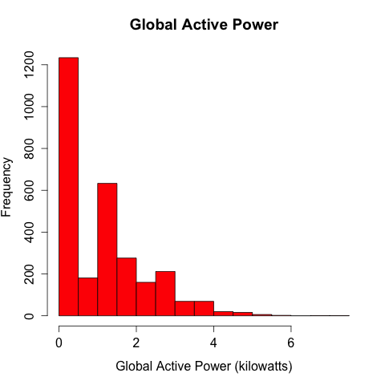
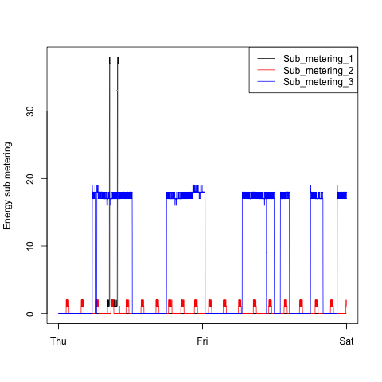

# Plotting Assignment 1 for Exploratory Data Analysis

* Title: Course Project
* Copyright (c): 2015 Elmar Hinz
* Code license: **MIT**, see LICENSE.txt
* Coursera ID: getdata-032
* Project URL: https://class.coursera.org/getdata-032/human_grading
* Dataset: [Electric power consumption](
  https://d396qusza40orc.cloudfront.net/exdata%2Fdata%2Fhousehold_power_consumption.zip)
  [20Mb]
* Description: Measurements of electric power consumption in one
  household with a one-minute sampling rate over a period of almost 4 years.
  Different electrical quantities and some sub-metering values are available.
* Original Assignment README.md:
  https://github.com/elmar-hinz/ExData_Plotting1/tree/master

This assignment uses data from
the <a href="http://archive.ics.uci.edu/ml/">UC Irvine Machine
Learning Repository</a>, a popular repository for machine learning
datasets. In particular, we will be using the "Individual household
electric power consumption Data Set".

## Reviewers Checklist

You find four plot rendering R scripts and four PNG files of width 480 * 480
pixel. It is required to this scripts read the data. As this is the same for
all of the four scripts I source a script called `common.R` to do this.

* [common.R](common.R)
* [plot1.R](plot1.R)
* [plot2.R](plot2.R)
* [plot3.R](plot3.R)
* [plot4.R](plot4.R)
* [plot 1](plot1.png)
* [plot 2](plot2.png)
* [plot 3](plot3.png)
* [plot 4](plot4.png)

Only two days of the original data are to display. This reduces the required
data from 127M to 179K. I did this by using of the command line tool `grep` and
stored the reduced data into `data/focus.txt`. Only this data was uploaded to
github.

`grep --regex="^Date" --regex="^[12]/2/2007;"
    data/household_power_consumption.txt > data/focus.txt`

The four Plots below are the results produced by my script.

